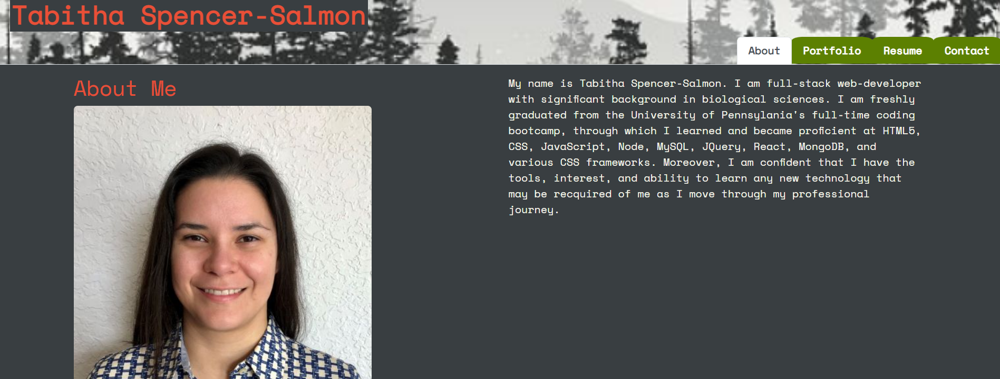

# React Portfolio
    
## Description
    
The purpose of this project is to make a professional portfolio using React that will eventually be what I will show employers.

    
## Table of Contents

[Description](#description)

[Link](#link)

[Shout-outs](#shout-outs)

[License](#license)

[Questions](#questions)

## Link

[https://tabithaly.github.io/react-portfolio/](https://tabithaly.github.io/react-portfolio/)
    
## Shout-Outs
    
Thanks to Leif Hetland and Ben White for all their help in office hours. 
    
## License 

    
## Questions?

[https://github.com/TabithaLy](https://github.com/TabithaLy)